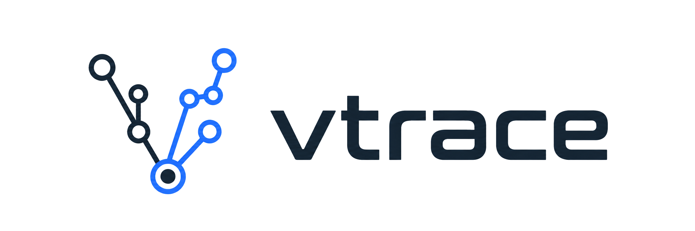
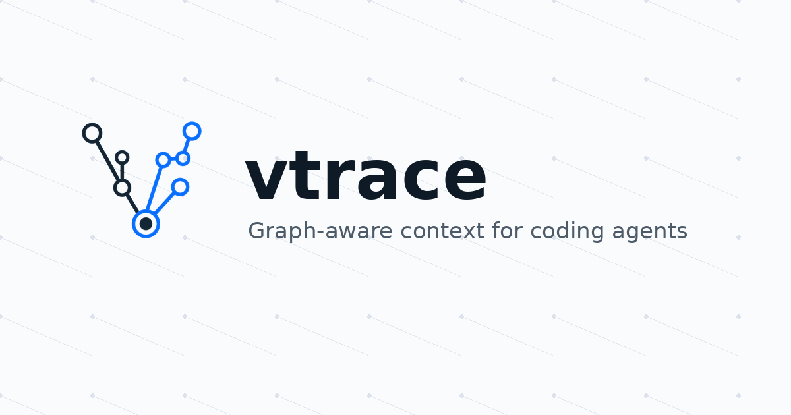

<p align="center">
  
</p>

<p align="center">
  <strong>AST-aware code context capsules for lower-token coding agents.</strong>
</p>

<p align="center">
  Repo-bound, local-first code indexing and MCP context for structural code exploration.
</p>

`vtrace` builds a deterministic index for a local repository, exposes CLI, MCP, and private/local VS Code surfaces, and gives you practical commands for setup, status, context packaging, skeleton views, impact graphs, and other bounded structural analysis.

It is designed for coding agents and human operators that need compact, inspectable repository context without sending the project through a remote indexing service.

## What VTRACE delivers

VTRACE analyzes codebases at the AST/symbol level, combines hybrid search with lightweight code-graph context, and returns compressed context capsules with session memory. In benchmarked workflows, VTRACE reduces first-pass token usage by delivering the smallest useful code evidence instead of dumping whole files or broad grep results.

The product surface, in one line: analyzes codebases at the AST level, identifies the most relevant code via hybrid search, and delivers compressed context capsules with session memory. In internal validation this has measured meaningfully lower downstream agent-side token usage (measured figures and their sources below).

What that means in practice:

- AST/symbol-aware codebase analysis
- hybrid search
- compressed context capsules
- session memory
- token reduction in benchmarked workflows

### Benchmark caveats

- Token reduction is measured downstream agent-side usage in internal validation, not guaranteed for every task.
- First-pass token reduction and repair-side recovery cost are reported separately.
- A verified generated-parser repair conversion is single-instance evidence, not an aggregate SWE-bench score.

The measured numbers, and where they come from:

- **Stage 5, 50-task clean-core run:** −26.7% total agent tokens and −25.0% cost, with resolution preserved (20/50 vs 20/50 baseline) — see [`stage5_m92_core_reduction50_validation.md`](./benchmarks/stage5_vexp_swe_bench_smoke/results/stage5_m92_core_reduction50_validation.md).
- **Stage 3, 12 paired controlled Claude Code tasks:** 46.5% mean actual total-token reduction — see [`STAGE3_RESULTS.md`](./benchmarks/arc_stage3_agent_usage/STAGE3_RESULTS.md).

These are **measured downstream agent-run figures** (VTRACE + agent, from run telemetry), not a tokenizer-accurate budget guarantee, and they vary by workload. Internally the capsule budgeter is **deterministic and character-based** (`CapsuleBudgetModel.CharacterCount`); the "tokens" it reports are a `chars/4` estimate, not a model tokenizer. Stage 5 results are **integrated downstream validation** — VTRACE + agent + harness + evaluator — not a pure deterministic-core benchmark and not a public SWE-bench pass@1 claim; the M94→M103 deterministic retrieval/capsule scoreboard (plan: [`docs/M94_DETERMINISTIC_SCOREBOARD_PLAN.md`](./docs/M94_DETERMINISTIC_SCOREBOARD_PLAN.md)) measures deterministic-core quality separately. The behavioral guards (V4 tool-loop, C7_D cost) are **default-off diagnostics**, not the token-reduction mechanism; the env guard and shell guard are Stage 5 **safety infrastructure**, not product token-reduction features. Full accounting: [`docs/current_product_state.md`](./docs/current_product_state.md).

## What vtrace is for

Use `vtrace` when you want:

- a repo-local structural index instead of a remote service
- deterministic outputs you can inspect and reproduce
- a stable MCP server for Claude Code or Codex
- compact task context for coding sessions
- conservative answers about file structure, symbol impact, and symbol-to-symbol paths

`vtrace` is intentionally structural. It does not pretend to do runtime tracing, semantic dataflow, or fuzzy architectural guessing.

## Requirements

- [Bun](https://bun.sh/) installed locally
- a local repository to index
- Claude Code or Codex only if you want MCP config installed automatically

## Install

Clone the repo and install dependencies:

```bash
git clone <repo-url> vtrace
cd vtrace
bun install
```

Run the local wrapper directly from the repo:

```bash
./bin/vtrace --help
```

If you put `vtrace` on your `PATH`, you can drop the `./bin/` prefix in the examples below.

## Quick Start

Replace `/path/to/your/repo` with the repository you want to inspect.

Set up a repo for `vtrace`:

```bash
./bin/vtrace setup /path/to/your/repo
./bin/vtrace status /path/to/your/repo
```

Inspect structure directly from the shell:

```bash
./bin/vtrace skeleton /path/to/your/repo src/controller.ts
./bin/vtrace impact-graph /path/to/your/repo "src/session.ts::SessionManager.createSession"
./bin/vtrace intent /path/to/your/repo "trace how sessions are created"
./bin/vtrace capsule /path/to/your/repo "smallest safe edit surface for session creation"
```

Launch the repo-bound MCP server manually when needed:

```bash
./bin/vtrace mcp-serve --repo /path/to/your/repo
```

In normal use you usually do not run `mcp-serve` yourself after setup. Claude Code and Codex launch it through the installed MCP config.

## Shell Workflow

The main user-facing shell commands are:

| Command         | Purpose                                                                                                         |
| --------------- | --------------------------------------------------------------------------------------------------------------- |
| `setup`         | Initialize repo-local state, build or refresh the index, install agent config, and optionally start the daemon. |
| `status`        | Show compact readiness and freshness state.                                                                     |
| `doctor`        | Run a more detailed readiness and runtime inspection.                                                           |
| `claude-config` | Install or preview Claude Code or Codex MCP config.                                                             |
| `daemon`        | Manage the optional background runtime lifecycle.                                                               |
| `watch`         | Mark the index stale when indexed source files change.                                                          |
| `workspace`     | Create, update, list, and inspect `.vtrace/workspace.json`.                                                     |
| `mcp-serve`     | Start the repo-bound MCP server entrypoint.                                                                     |

There are also direct inspection commands for manual flows:

- `index`
- `intent`
- `capsule`
- `skeleton`
- `impact-graph`
- `handoff`
- `runs`
- `rules`
- `check-capsule`
- `compress-sessions`
- `run-pipeline`
- `expand-vexp-ref`

## MCP Workflow

For broad coding, debugging, refactor, and repo-understanding tasks, start with `get_code_context`.
`run_pipeline` remains available as the stable/internal equivalent.

Use the specialized tools when the question becomes narrower:

- `get_context_capsule`: compact task context only
- `get_impact_graph`: use when the user asks what breaks, blast radius, dependents, callers, references, or impact of changing a known symbol
- `get_skeleton`: use when the relevant file path is already known and you need structural overview
- `search_symbols`: use for exact symbol lookup or when the context result is weak
- `search_logic_flow`: bounded static path between two exact symbol FQNs over `contains`, `imports`, and statically resolved `calls` edges (coverage reports whether call-flow evidence was available; not runtime tracing)
- `search_memory` / `get_session_context`: continuity
- `index_status` / `workspace_setup`: health and setup
- `save_observation`: durable memory
- `expand_vexp_ref`: resolve exact deferred V-REF hashes from the current process hot cache or retained repo-local stored payloads

For the practical tool-by-tool guide, see [MCP Tool Cheat Sheet](./docs/mcp_tool_cheat_sheet.md).

## Agent Setup

`setup` installs MCP config for the selected shell agent.

Supported agents:

- `claude-code` (default)
- `codex`

Examples:

```bash
./bin/vtrace setup /path/to/your/repo --agent codex
./bin/vtrace claude-config /path/to/your/repo --agent codex --dry-run
```

The command name stays `claude-config` for compatibility even when you target Codex.

## Repo-Local State

`vtrace` keeps repo-local state under `.vtrace/`:

- `.vtrace/config.json`: repo-local config and resolved paths
- `.vtrace/state.json`: readiness, latest run, and freshness metadata
- `.vtrace/index.sqlite`: the repo-local SQLite index, including bounded persisted V-REF payloads
- `.vtrace/workspace.json`: optional multi-repo workspace config

Repeated `setup` is safe. If the repo is already ready, `vtrace` reuses the current state conservatively.

## Release and Distribution

`vtrace` is currently distributed as a local-source install. The supported install path today is cloning this repository, running `bun install`, and using the repo-local `./bin/vtrace` launcher.

The VS Code extension is private/local packaging only. It can be packaged locally with:

```bash
bun run package:vscode
```

For source-checkout use, set the VS Code `vtrace.cliPath` setting to an absolute executable path such as `/path/to/vtrace/bin/vtrace` in the environment where the extension host runs. This matters for Remote SSH, WSL, and containers. The source-checkout launcher requires Bun; the extension prepends common user binary locations such as `~/.bun/bin` and `~/.local/bin` when spawning CLI commands.

npm and VS Marketplace publication are planned release options, but they are not part of the current RC1 release path.

## Brand Assets

The README uses the project artwork from [docs/assets/brand](./docs/assets/brand).

| Asset                         | Preview                                                                                       | Intended use                                                |
| ----------------------------- | --------------------------------------------------------------------------------------------- | ----------------------------------------------------------- |
| `vtrace-logo-transparent.png` |    | README header, docs, and light or dark backgrounds.         |
| `vtrace-mark-transparent.png` |     | Square avatars, extension UI, and compact brand placements. |
| `vtrace-icon-256.png`         |             | App icons and smaller rendered surfaces.                    |
| `vtrace-social-card.png`      |  | Social previews and presentation cover images.              |

## Recommended Reading

- [Getting Started](./docs/getting_started.md)
- [CLI Usage](./docs/cli_usage.md)
- [MCP Tools Reference](./docs/mcp_tools.md)
- [MCP Tool Cheat Sheet](./docs/mcp_tool_cheat_sheet.md)
- [Troubleshooting](./docs/troubleshooting.md)

## Product vs engineering controls

VTRACE's public product surface is the context-capsule system. The Stage 5 control-loop work is internal benchmark/engineering machinery, not a user-facing configuration story.

Product surface:

- index code
- retrieve compact context
- return context capsule
- session memory
- MCP/code-agent integration

Engineering controls (benchmark/internal only):

- ordered telemetry
- patch-shape probes
- gated critic/repair
- Docker verification
- policy accounting

VTRACE's repair/control-loop experiments are internal benchmark controls, not the public product surface. They are used to avoid blind reruns when compact context was correct but an agent produced a known bad patch shape. Recovery costs are tracked separately from first-pass token-reduction measurements. For the deeper technical write-up, see the [Stage 5 benchmark README](./benchmarks/stage5_vexp_swe_bench_smoke/README.md).

## Current Boundaries

`vtrace` is conservative by design:

- structural outputs are based on indexed repository data
- `search_logic_flow` requires exact start and end FQNs and traverses `contains`, `imports`, and statically resolved `calls` edges; `calls` edges are extracted for Python, TypeScript, and Cython in this milestone, so repos without extracted call edges report `callFlowEvidenceAvailable: false` rather than implying call flow was traced
- impact and flow tools are not runtime execution proofs
- watcher freshness is mark-stale-only by default; `watch --auto-reindex` is explicit opt-in and keeps failures visible
- V-REF expansion is exact stored-payload lookup with bounded repo-local retention, not fuzzy reconstruction
- the optional daemon is inspectable, but not required
- VTRACE is a structural context engine — not a semantic oracle, a dynamic/runtime call graph, or a complete multi-language blast-radius engine; call/reference coverage is deepest for Python and conservative for TypeScript/Cython
