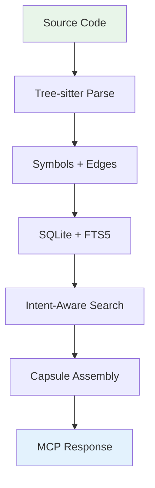
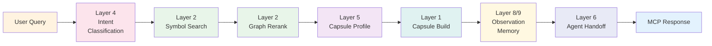
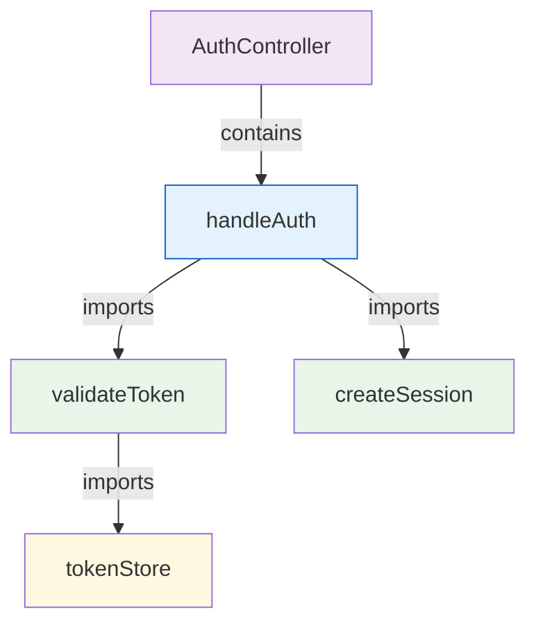
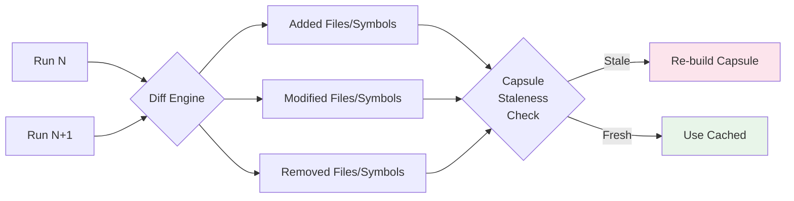
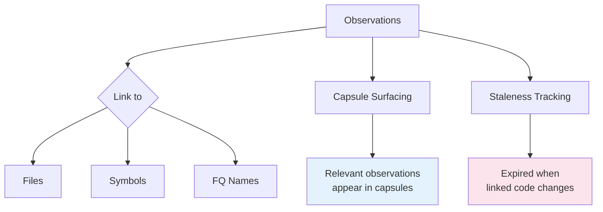
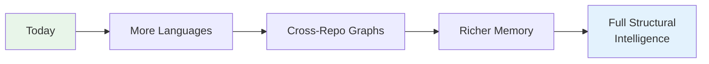
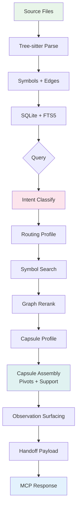

# vexb

## Local Deterministic Code Indexer

Structural intelligence for AI-assisted code understanding

<div class="abs-br m-6 text-sm opacity-50">
Calvin Pieters
</div>

<!--
Opening slide — introduce the project name and tagline.
-->

---
layout: section
---

# The Problem

---

# Why Do AI Coding Assistants Struggle?

<v-clicks>

- **No structural understanding** — AI sees text, not code relationships
- **Naive search falls short** — grep and file matching miss symbol connections
- **Context windows are finite** — you can't dump an entire repo into a prompt
- **No intent awareness** — the same query returns the same results regardless of task

</v-clicks>

<div v-click class="mt-8 p-4 bg-orange-50 rounded-lg border border-orange-200">

The core challenge: **surface the right code, in the right amount, for the right task**

</div>

<!--
Set up the problem space. Each point builds on the last — from raw capability gaps to the nuanced problem of intent-aware context selection.
-->

---
layout: section
---

# What is vexb?

---
layout: two-cols
---

# vexb at a Glance

<v-clicks>

- Parses source code with **Tree-sitter** into symbols and edges
- Classifies **user intent** to shape context surfacing
- Assembles budget-aware **capsules** of relevant code
- Exposes everything via an **MCP server**

</v-clicks>

::right::

<div class="ml-4 mt-12">



</div>

<!--
High-level overview — what it does and the data flow at a glance.
-->

---

# Five Design Principles

<div class="grid grid-cols-5 gap-4 mt-8">

<div v-click class="text-center p-4 bg-blue-50 rounded-lg">
<div class="text-3xl mb-2">&#x1f9e9;</div>
<div class="font-bold">Deterministic</div>
<div class="text-xs mt-1 opacity-70">Same input, same output. Always.</div>
</div>

<div v-click class="text-center p-4 bg-green-50 rounded-lg">
<div class="text-3xl mb-2">&#x1f50d;</div>
<div class="font-bold">Inspectable</div>
<div class="text-xs mt-1 opacity-70">Every decision is traceable</div>
</div>

<div v-click class="text-center p-4 bg-purple-50 rounded-lg">
<div class="text-3xl mb-2">&#x1f578;&#xfe0f;</div>
<div class="font-bold">Structural</div>
<div class="text-xs mt-1 opacity-70">Graph-based code analysis</div>
</div>

<div v-click class="text-center p-4 bg-amber-50 rounded-lg">
<div class="text-3xl mb-2">&#x1f4ca;</div>
<div class="font-bold">Budget-aware</div>
<div class="text-xs mt-1 opacity-70">Character budgets, graceful compression</div>
</div>

<div v-click class="text-center p-4 bg-red-50 rounded-lg">
<div class="text-3xl mb-2">&#x1f3af;</div>
<div class="font-bold">Intent-driven</div>
<div class="text-xs mt-1 opacity-70">Task shapes the results</div>
</div>

</div>

<!--
The five pillars that every design decision comes back to.
-->

---
layout: section
---

# Architecture Overview

## The 9-Layer Pipeline

---

# The Full Pipeline



<div class="mt-4 text-sm opacity-70 text-center">
Each layer is independently testable with its own spec document
</div>

<!--
The pipeline flows left to right. Note: layer numbers don't match execution order — they reflect the order they were built.
-->

---
layout: section
---

# Layer 1 — Indexing

## Parsing source code into structured data

---
layout: two-cols
---

# Indexing with Tree-sitter

<v-clicks>

- Parses **TypeScript**, **Python**, **Cython** into ASTs
- Extracts symbols: functions, classes, methods, interfaces, type aliases
- Builds two edge types:
  - `Contains` — structural nesting
  - `Imports` — module dependencies
- **Content-addressed IDs** via SHA256
- Stored in **SQLite** with **FTS5** for full-text search

</v-clicks>

::right::

<div class="ml-4 mt-4">

```ts
// Content-addressed identity
const id = computeSymbolId(
  filePath,
  symbolName,
  symbolKind
); // SHA256 hash

// Extracted symbol record
interface SymbolRecord {
  id: string;
  fileId: string;
  name: string;
  fqName: string;
  kind: SymbolKind;
  startLine: number;
  endLine: number;
  content: string;
  isExported: boolean;
}
```

</div>

<!--
Tree-sitter gives us incremental, error-tolerant parsing. Content-addressed IDs mean the same code always produces the same identity — crucial for diffing and caching.
-->

---
layout: section
---

# Layer 2 — Retrieval & Ranking

## Finding the right symbols, not just matching ones

---

# Two-Stage Search

<div class="grid grid-cols-2 gap-8 mt-4">

<div v-click>

### Stage 1: Symbol Search

| Backend | Use Case |
|---------|----------|
| **Plain SQL** | Precise, exact matches |
| **FTS5** | Fuzzy, natural language |

**Ranking signals:**
- Boundary boosts (exported symbols rank higher)
- Broad query boosts
- Test-aware downweighting

</div>

<div v-click>

### Stage 2: Graph Reranking



Symbols connected to matched candidates get **boosted** via in-degree, out-degree, and neighborhood signals

</div>

</div>

<!--
The two-stage approach: first find candidates via text matching, then rerank using structural graph relationships. This is what makes vexb structure-aware.
-->

---
layout: section
---

# Layer 3 — Memory & Staleness

## Knowing what changed and what's stale

---

# Incremental Intelligence

<v-clicks>

- Tracks **file diffs** across index runs — additions, removals, modifications
- Tracks **symbol diffs** — new symbols, removed symbols, changed content
- **Capsule staleness detection**: has the code a capsule references changed?
- Enables **incremental re-indexing** — only process what changed

</v-clicks>

<div v-click class="mt-6">



</div>

<!--
Staleness tracking avoids rebuilding capsules when nothing relevant has changed — a significant efficiency win for large repos.
-->

---
layout: section
---

# Layer 4 — Intent Classification

## Same query, different task, different results

---

# Rule-Based Intent Classifier

<div class="grid grid-cols-2 gap-8 mt-4">

<div>

### Four Intents

<v-clicks>

- **Debug** — tight focus, error paths, call chains
- **Refactor** — broad structural context, dependencies
- **Explain** — full content, stable and readable
- **Feature** — extension points, related patterns

</v-clicks>

<div v-click class="mt-4 p-3 bg-amber-50 rounded border border-amber-200 text-sm">

**Why rule-based?** Fast, predictable, testable. No ML model in the indexing path = zero latency, full determinism.

</div>

</div>

<div v-click>

### Same Query, Different Results

Query: `"handleAuth"`

| Intent | Focus |
|--------|-------|
| Debug | Error paths, validation logic |
| Refactor | All callers, structural dependencies |
| Explain | Full implementation with docs |
| Feature | Extension points, similar patterns |

Each intent selects a **routing profile** controlling search backend, pool size, and graph weights.

</div>

</div>

<!--
This is one of vexb's most distinctive design choices — intent shapes everything downstream. No ML means this runs in microseconds.
-->

---
layout: section
---

# Layer 5 — Capsule Profiles

## Tuning context assembly to intent

---

# Four Profiles

| Profile | Intent | Focus | Compression | Support Items |
|---------|--------|-------|-------------|---------------|
| **DebugTight** | Debug | Minimal, focused | High | Narrow |
| **RefactorStructural** | Refactor | Broad structure | Balanced | Wide |
| **ExplainStable** | Explain | Full content | Low | Minimal |
| **FeatureBalanced** | Feature | Extension-aware | Balanced | Medium |

<v-click>

<div class="mt-6 p-4 bg-blue-50 rounded-lg">

**How profiles work:** Each profile configures pivot count, support selection strategy, character budget allocation, and compression thresholds. The capsule builder reads these settings to assemble the optimal context package.

</div>

</v-click>

<!--
Profiles are the bridge between intent classification and capsule assembly — they translate "what kind of task" into "how to build context."
-->

---
layout: section
---

# Capsule Assembly

## The core output: right code, right amount

---
layout: two-cols
---

# Building a Capsule

<v-clicks>

- **Pivots** — primary search results (the code you asked about)
- **Support** — structural dependencies, related symbols
- **Content modes** degrade gracefully:
  - Full &rarr; SignatureOnly &rarr; Summary &rarr; Stub
- **Character budget** enforcement with compression fallbacks
- Every inclusion carries a **reason** (why this code was selected)

</v-clicks>

::right::

<div class="ml-4 mt-4">

```ts
// Capsule item roles
type CapsuleItemRole =
  | "Pivot"    // Primary result
  | "Support"; // Supporting context

// Content modes
type CapsuleContentMode =
  | "Full"          // Complete source
  | "SignatureOnly" // Just the API
  | "Summary"       // Compressed
  | "Stub";         // Minimal reference

// Every item explains itself
interface CapsuleItem {
  symbol: SymbolRecord;
  role: CapsuleItemRole;
  contentMode: CapsuleContentMode;
  inclusionReason: string;
}
```

</div>

<!--
The capsule is vexb's core output artifact. Graceful degradation means you always get useful context even under tight budgets.
-->

---
layout: section
---

# Layers 8-9 — Observation Memory

## Learning from sessions over time

---

# Observation Memory System

<div class="grid grid-cols-2 gap-8">

<div>

### What Gets Stored

<v-clicks>

- **Decisions** — choices made during sessions
- **Insights** — discovered patterns or knowledge
- **Warnings** — things that went wrong
- **Dead ends** — approaches that failed
- **Tool calls** — auto-captured from MCP interactions

</v-clicks>

</div>

<div v-click>

### How It's Used



Observations are **linked** to specific code entities and **surfaced** inside capsules when relevant to the current query.

</div>

</div>

<!--
This is what gives vexb session continuity — it remembers what happened and surfaces relevant history when you come back to the same code.
-->

---
layout: section
---

# Layer 6 — Agent Handoff

## Packaging context for downstream AI

---

# Handoff Payload

<v-clicks>

- Packages capsule into a deterministic **HandoffPayload**
- Includes query, intent, capsule items, metadata, provenance, trust info
- Designed for passing context to **downstream AI agents and tools**
- Protocol adapters (Layer 7) handle **serialization formats**

</v-clicks>

<div v-click class="mt-6">

```ts
interface HandoffPayload {
  query: string;
  intent: IntentClassification;
  capsule: CapsuleItem[];
  metadata: {
    repoRoot: string;
    indexRun: string;
    timestamp: string;
  };
  provenance: ProvenanceInfo;  // How was this built?
  trust: TrustInfo;            // How fresh/reliable?
}
```

</div>

<!--
The handoff payload is what makes vexb composable — any downstream tool or agent gets structured, trustworthy context with full provenance.
-->

---
layout: section
---

# MCP Server Interface

## How tools interact with vexb

---

# Exposed MCP Tools

<div class="grid grid-cols-2 gap-6 mt-4">

<div>

### Indexing & Search

<v-clicks>

- `index_repo` — Index a repository
- `search_symbols` — Search code symbols
- `route_query` — Classify and route a query
- `list_runs` — List index runs

</v-clicks>

</div>

<div>

### Capsules & Memory

<v-clicks>

- `build_capsule` — Assemble context capsule
- `build_handoff` — Package for agent handoff
- `check_capsule_staleness` — Detect stale context
- `save_observation` — Store observation
- `search_memory` — Query observations
- `get_session_context` — Session history

</v-clicks>

</div>

</div>

<div v-click class="mt-6 p-4 bg-green-50 rounded-lg border border-green-200 text-center">

Any MCP-compatible client (Claude, VS Code, custom agents) can use these tools directly

</div>

<!--
The MCP server is vexb's integration surface — it exposes every capability as a tool that AI assistants can call.
-->

---

# Tech Stack

<div class="grid grid-cols-2 gap-8 mt-8">

<div>

| Component | Technology |
|-----------|-----------|
| **Runtime** | Bun |
| **Language** | TypeScript |
| **Parsing** | Tree-sitter |
| **Database** | SQLite (bun:sqlite) + FTS5 |
| **Protocol** | MCP |
| **Supported** | TypeScript, Python, Cython |

</div>

<div v-click class="flex items-center">

<div class="p-6 bg-green-50 rounded-lg border border-green-200">

### Zero External Dependencies

- No cloud services
- No API keys
- No network required
- Fully local
- Fully deterministic
- **Your code never leaves your machine**

</div>

</div>

</div>

<!--
The minimal dependency footprint is intentional — vexb is designed to be trustworthy and self-contained.
-->

---
layout: section
---

# Design Decisions

## What makes vexb different

---

# Key Design Choices

<div class="space-y-4 mt-4">

<div v-click class="p-4 bg-blue-50 rounded-lg">

**Content-Addressed IDs** — SHA256 hashing means identical code always maps to the same identity. Enables diffing, caching, and deduplication across index runs.

</div>

<div v-click class="p-4 bg-green-50 rounded-lg">

**Budget-Aware Assembly** — Character budgets prevent context overflow. Compression degrades gracefully: Full &rarr; SignatureOnly &rarr; Summary &rarr; Stub. You always get useful context.

</div>

<div v-click class="p-4 bg-purple-50 rounded-lg">

**Explainability Throughout** — Every search result has match explanations. Every capsule item has inclusion reasons. Every classification has matched rules. Nothing is a black box.

</div>

<div v-click class="p-4 bg-amber-50 rounded-lg">

**No ML in the Loop** — Rule-based intent classification is fast, predictable, and testable. No model dependency in the indexing path means zero latency and full reproducibility.

</div>

</div>

<!--
These four choices together create a system you can trust — deterministic, explainable, and efficient.
-->

---

# What's Next

<v-clicks>

- **Additional language support** — Go and Rust parsers (enums already defined)
- **Tree-sitter grammar expansion** — more language features
- **Cross-repository graph analysis** — dependencies across repos
- **Richer observation memory** — deeper session continuity

</v-clicks>

<div v-click class="mt-8">



</div>

<!--
The architecture is designed for extension — adding a new language is a parser + grammar, everything downstream just works.
-->

---
layout: center
---

# Full Data Flow



---
layout: center
class: text-center
---

# Thank You

**vexb** — Local Deterministic Code Indexer

Structural intelligence for AI-assisted code understanding

<div class="mt-8 text-sm opacity-60">

Deterministic &middot; Inspectable &middot; Structural &middot; Budget-aware &middot; Intent-driven

</div>
